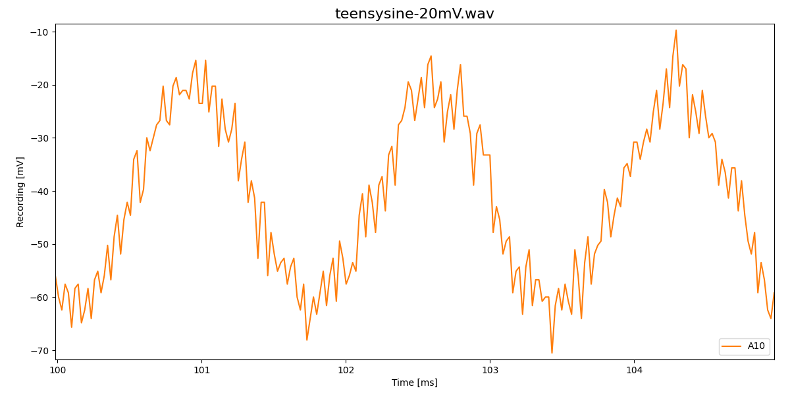
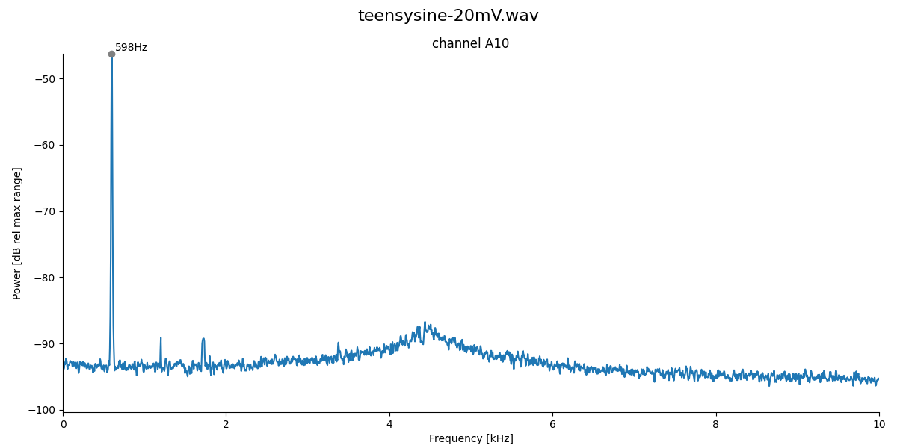
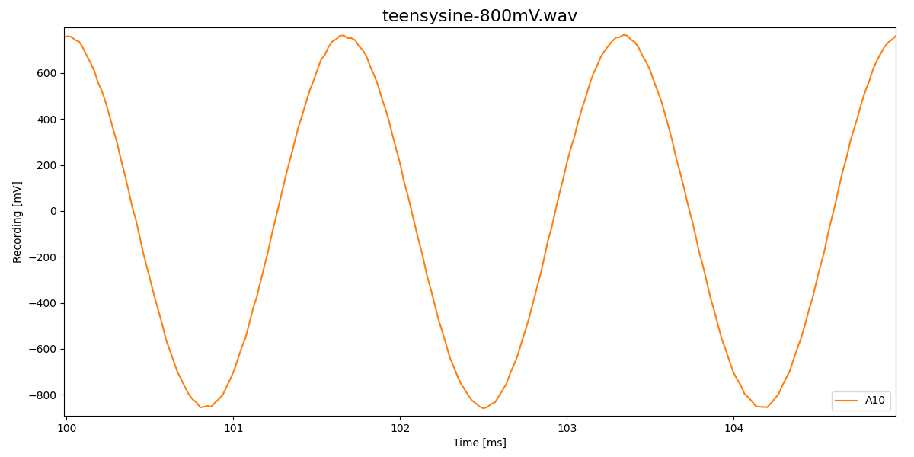
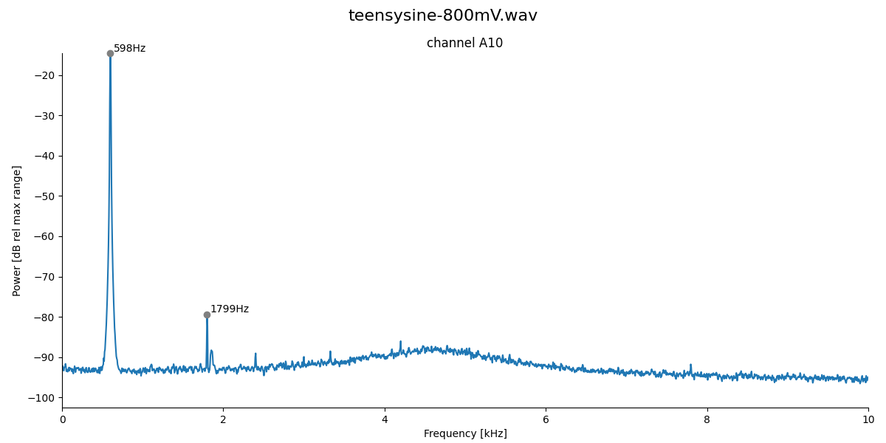
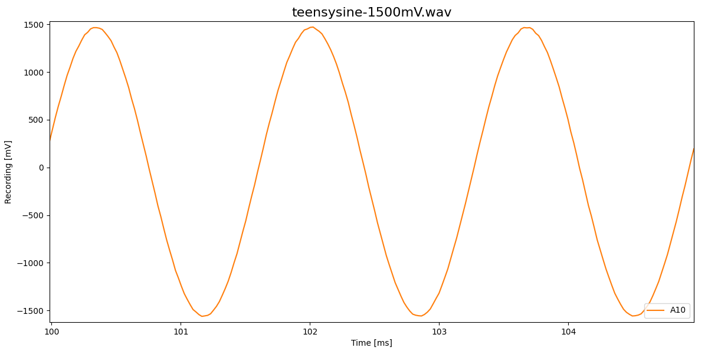
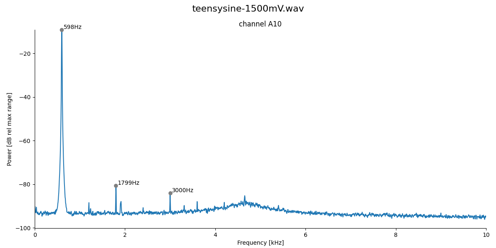

# TeensyADC

Using the Teensy's internal ADCs for recording data using the
[`TeensyADC`](../src/TeensyADC.h) class.

If not mentioned otherwise, all data from Teensy 3.5.

## Pin assignment

### Teensy 3.5

Output of `TeensyADC::pinAssignment()`:

| pin | ADC0 | ADC1 |
| :-- | ---: | ---: |
| A0  |  1   | 0    |
| A1  |  1   | 0    |
| A2  |  1   | 1    |
| A3  |  1   | 1    |
| A4  |  1   | 0    |
| A5  |  1   | 0    |
| A6  |  1   | 0    |
| A7  |  1   | 0    |
| A8  |  1   | 0    |
| A9  |  1   | 0    |
| A10 |  1   | 1    |
| A11 |  0   | 1    |
| A12 |  0   | 1    |
| A13 |  0   | 1    |
| A14 |  1   | 0    |
| A15 |  1   | 0    |
| A16 |  0   | 1    |
| A17 |  0   | 1    |
| A18 |  0   | 1    |
| A19 |  0   | 1    |
| A20 |  0   | 1    |
| A21 |  1   | 0    |
| A22 |  0   | 1    |
| A23 |  0   | 1    |
| A24 |  0   | 1    |
| A25 |  1   | 0    |
| A26 |  0   | 1    |

### Teensy 3.6

Output of `TeensyADC::pinAssignment()`:

| pin | ADC0 | ADC1 |
| :-- | ---: | ---: |
| A0  |   1  |  0   |
| A1  |   1  |  0   |
| A2  |   1  |  1   |
| A3  |   1  |  1   |
| A4  |   1  |  0   |
| A5  |   1  |  0   |
| A6  |   1  |  0   |
| A7  |   1  |  0   |
| A8  |   1  |  0   |
| A9  |   1  |  0   |
| A10 |   1  |  1   |
| A11 |   0  |  1   |
| A12 |   0  |  1   |
| A13 |   0  |  1   |
| A14 |   1  |  0   |
| A15 |   1  |  0   |
| A16 |   0  |  1   |
| A17 |   0  |  1   |
| A18 |   0  |  1   |
| A19 |   0  |  1   |
| A20 |   0  |  1   |
| A21 |   1  |  0   |
| A22 |   0  |  1   |
| A23 |   0  |  1   |
| A24 |   0  |  1   |
| A25 |   0  |  0   |
| A26 |   0  |  0   |

Same as Teensy 3.5 but without A25 and A26.

## Maximum sampling rates

Maximum sampling rates in kHz with averaging of 1, high sampling and
conversion speeds (measured with the [`maxrate`](../examples/maxrate) example):

|  channels0 | channels1 | 10bit | 12bit | 16bit |
| ---------- | --------- | ----: | ----: | ----: |
|  1         | 0         |   523 |   531 |   453 | 
|  2         | 0         |   250 |   250 |   210 | 
|  4         | 0         |   125 |   125 |   105 | 
|  8         | 0         |    62 |    62 |    50 | 
|  1         | 1         |   531 |   519 |   453 | 
|  2         | 2         |   234 |   234 |   199 | 
|  4         | 4         |   117 |   117 |   101 | 
|  8         | 8         |    58 |    58 |    50 | 

Note that in an application these maximum sampling rates can be
substantially lower.

Effect of averaging on sampling rate in kHz for 12bit,
high conversion and sampling speed, and a single ADC:

| channels | a=1 | a=4 | a=16 |
| -------- | --: | --: | ---: |
| 1        | 531 | 148 |   35 |
| 2        | 250 |  70 |   15 |
| 4        | 125 |  35 |    7 |
| 8        |  62 |  15 |    3 |

Effect of conversion and sampling speeds on sampling rate in kHz for
12bit, averaging set to 1, and a single ADC:

High conversion speed:

| channels | high | med | low sampling speed |
| -------- | ---: | --: | -----------------: |
| 1        |  531 | 457 | 386		     |
| 2        |  250 | 218 | 187		     |
| 4        |  125 | 109 |  93		     |
| 8        |   62 |  54 |  46		     |

Medium conversion speed:

| channels | high | med | low sampling speed |
| -------- | ---: | --: | -----------------: |
| 1        |  285 | 246 | 207		     |
| 2        |  136 | 121 | 101		     |
| 4        |   66 |  62 |  50		     |
| 8        |   31 |  27 |  23		     |

Low conversion speed:

| channels | high | med | low sampling speed |
| -------- | ---: | --: | -----------------: |
| 1        |  144 | 125 | 101		     |
| 2        |   70 |  62 |  50		     |
| 4        |   35 |  27 |  23		     |
| 8        |   15 |  15 |  11		     |

## Noise

Conversion speed, sampling speed and in particular averaging help to
reduce noise. Noise also depends on the pin.  This can be tested with
the [`averaging`](../examples/averaging) example.

For 40kHz and 12bit we get for the standard deviations of the raw
integer readings of two channels:

| convers  | sampling | avrg |   A2 |  A16    |
| :------- | :------- | ---: | ---: | ------: |
| veryhigh | veryhigh |    1 |  1.8 |  2.5    |
| veryhigh | veryhigh |    4 |  1.0 |  1.4    |
| veryhigh | veryhigh |    8 |  0.9 |  1.0    |
| veryhigh | veryhigh |   16 |  0.7 |  1.0    |
| veryhigh | veryhigh |   32 |  0.6 |  0.9    |
| veryhigh | high     |    1 |  2.1 |  2.3    |
| veryhigh | high     |    4 |  0.8 |  1.0    |
| veryhigh | high     |    8 |  0.6 |  0.7 *  |
| veryhigh | high     |   16 |  0.5 |  0.5 ** |
| veryhigh | med      |    1 |  1.7 |  2.3    |
| veryhigh | med      |    4 |  0.8 |  0.9    |
| veryhigh | med      |    8 |  0.6 |  0.8    |
| veryhigh | med      |   16 |  0.6 |  0.6 *  |
| veryhigh | low      |    1 |  1.8 |  2.5    |
| veryhigh | low      |    4 |  0.7 |  1.0    |
| veryhigh | low      |    8 |  0.6 |  0.7 *  |
| veryhigh | low      |   16 |  0.6 |  0.6 *  |
| veryhigh | verylow  |    1 |  1.9 |  2.3    |
| veryhigh | verylow  |    4 |  0.7 |  0.8    |
| veryhigh | verylow  |    8 |  0.6 |  0.7    |
| veryhigh | verylow  |   16 |  0.7 |  0.8    |
| high     | veryhigh |    1 |  1.7 |  2.4    |
| high     | veryhigh |    4 |  0.8 |  1.1    |
| high     | veryhigh |    8 |  0.7 |  1.0    |
| high     | veryhigh |   16 |  0.7 |  1.0    |
| high     | high     |    1 |  1.7 |  2.3    |
| high     | high     |    4 |  0.8 |  0.9    |
| high     | high     |    8 |  0.7 |  0.7    |
| high     | med      |    1 |  1.9 |  2.3    |
| high     | med      |    4 |  0.8 |  0.9    |
| high     | med      |    8 |  0.6 |  0.7    |
| high     | low      |    1 |  1.7 |  2.2    |
| high     | low      |    4 |  0.8 |  0.9    |
| high     | low      |    8 |  0.6 |  0.8    |
| high     | verylow  |    1 |  1.7 |  2.3    |
| high     | verylow  |    4 |  0.9 |  1.0    |
| high     | verylow  |    8 |  0.6 |  0.7    |
| med      | veryhigh |    1 |  1.8 |  2.4    |
| med      | veryhigh |    4 |  0.9 |  1.1    |
| med      | veryhigh |    8 |  2.6 |  2.5    |
| med      | high     |    1 |  1.8 |  2.2    |
| med      | high     |    4 |  1.0 |  1.3    |
| med      | high     |    8 |  0.8 |  1.0    |
| med      | med      |    1 |  3.4 |  2.5    |
| med      | med      |    4 |  1.0 |  1.5    |
| med      | low      |    1 |  1.7 |  2.3    |
| med      | low      |    4 |  0.8 |  1.0    |
| med      | verylow  |    1 |  2.8 |  3.5    |
| med      | verylow  |    4 |  2.7 |  3.1    |
| low      | veryhigh |    1 |  3.2 |  3.8    |
| low      | veryhigh |    4 |  2.9 |  3.3    |
| low      | high     |    1 |  1.8 |  2.6    |
| low      | high     |    4 |  1.2 |  1.8    |
| low      | med      |    1 |  1.7 |  2.5    |
| low      | low      |    1 |  1.8 |  2.4    |
| low      | verylow  |    1 |  1.6 |  2.4    |
| verylow  | veryhigh |    1 |  1.7 |  2.5    |
| verylow  | veryhigh |    4 |  1.1 |  1.9    |
| verylow  | high     |    1 |  1.7 |  2.2    |
| verylow  | high     |    4 |  1.0 |  1.3    |
| verylow  | med      |    1 |  3.8 |  4.2    |
| verylow  | low      |    1 |  2.6 |  3.1    |
| verylow  | verylow  |    1 |  1.8 |  2.2    |

## Linearity

600Hz sine wave from sine-wave generator with ca. 1.6V offset applied
directly to the Teensy's A10 versus AGND pins. Recorded with 44.1kHz
sampling rate at 12bit, with 8x averaging, high conversion and high
sampling speeds on a Teensy 3.5.

- 20mV amplitude:

- 800mV amplitude:

- 1500mV amplitude:

Pretty linear with harmonics at less than -60dB!

